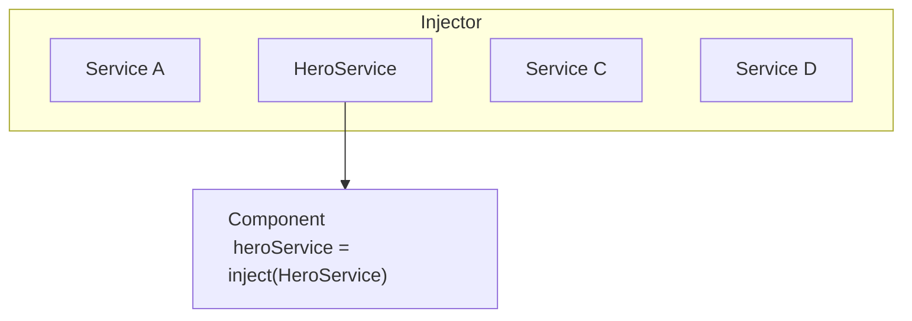

# Description

ependency injection, or DI, is one of the fundamental concepts in Angular. DI is wired into the Angular framework and allows classes with Angular decorators, such as Components, Directives, Pipes, and Injectables, to configure dependencies that they need.

Two main roles exist in the DI system: dependency consumer and dependency provider.

Angular facilitates the interaction between dependency consumers and dependency providers using an abstraction called `Injector`. When a dependency is requested, the injector checks its registry to see if there is an instance already available there. If not, a new instance is created and stored in the registry. Angular creates an application-wide injector (also known as the "root" injector) during the application bootstrap process.

## Providing a dependency

The first step is to add the `@Injectable` decorator to show that the class can be injected.

```typescript
@Injectable()
class HeroService {}
```

###  Preferred: At the application root level using `providedIn` 

```typescript
@Injectable({  providedIn: 'root'})
class HeroService {}
```

When you provide the service at the root level, Angular creates a single, shared instance of the HeroService and injects it into any class that asks for it.

###  At the Component level

You can provide services at `@Component` level by using the `providers` field of the `@Component` decorator. In this case the `HeroService` becomes available to all instances of this component and other components and directives used in the template.

```typescript
@Component({
  selector: 'hero-list',
  template: '...',
  providers: [HeroService]
})
class HeroListComponent {}
```

When you register a provider at the component level, you get a new instance of the service with each new instance of that component.

### At the application root level using `ApplicationConfig`

You can use the `providers` field of the `ApplicationConfig` (passed to the `bootstrapApplication` function) to provide a service or other `Injectable` at the application level.

In the example below, the `HeroService` is available to all components, directives, and pipes:

```typescript
export const appConfig: ApplicationConfig = {
    providers: [
      { provide: HeroService },
    ]
};
```


Then, in `main.ts`:

```typescript
bootstrapApplication(AppComponent, appConfig)
```

## Injecting/consuming a dependency

Use Angular's `inject` function to retrieve dependencies.

```ts
import {inject, Component} from 'angular/core';

@Component({/* ... */})
export class UserProfile {
  // You can use the `inject` function in property initializers.
  private userClient = inject(UserClient);

  constructor() {
    // You can also use the `inject` function in a constructor.
    const logger = inject(Logger);
  }
}
```

You can use the `inject` function in any [injection context](https://angular.dev/guide/di/dependency-injection-context). Most of the time, this is in a class property initializer or a class constructor for components, directives, services, and pipes.

When Angular discovers that a component depends on a service, it first checks if the injector has any existing instances of that service. If a requested service instance doesn't yet exist, the injector creates one using the registered provider, and adds it to the injector before returning the service to Angular.

When all requested services have been resolved and returned, Angular can call the component's constructor with those services as arguments.


