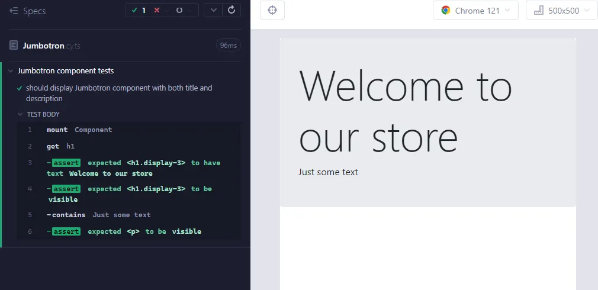

# Cypress

Permet les tests end-to-end, tests de composants, tests d'accessibilité, et autre...

[Documentation](https://docs.cypress.io/app/get-started/)

Exemples de tests dans le dossier cypress.

Exemple de l'interface :



Celle ci permet de suivre la chronologie des actions, des assertions de test et des comportements (comme les requêtes HTTP)


## Commencer

```
npx cypress open
```

## Tester un composant

Utilisation de `.mount()`

```typescript
describe('Jumbotron component tests', () => {
 it('should display Jumbotron component', () => {
   cy.mount(JumbotronComponent); // Monte le composant
   cy.get("h1").contains("Welcome to our store").should("be.visible"); // Check l'écran
 })
})
```

### Gestion des dépendances

```typescript
cy.mount(CurrencySwitcherComponent, {
    declarations: [ChildComponent],
    providers: [CurrencyService],
    imports: [HttpClientModule]
  });
```

### Input data

```typescript
cy.mount(JumbotronComponent,{
    componentProperties: {
       // title is an @Input() of JumbotronComponent
       title: "My custom title"
    }
});
```

Ou bien, utiliser la syntaxe de template d'Angular :

```typescript
cy.mount(`<app-jumbotron title='My title' />`,{
    declarations: [JumbotronComponent]
   }
);
```

### Output

```typescript
cy.mount(`
    <app-license-plate [plate]="plate"
                (buttonClick)="buttonClick.emit($event)" >
      </app-license-plate>`,
  {declarations: [LicensePlateComponent],
    componentProperties:{
        plate: CALIFORNIA_PLATE,
        buttonClick: createOutputSpy("buttonClick")
    }});
```

`createOutputSpy()` créé un Event emitter Angular à tacker lorsque l'ouput emet une valeur, comme l'exemple qui suit :


```typescript
cy.get("@buttonClick").should("have.been.calledWith", id);
```

### Comment mocker des dépendances ?

``cy.mount`` permet comme avec TestBed de renseigner les dépendances.

```typescript
cy.mount(`<app-currency-switcher />`, {
    declarations: [CurrencySwitcherComponent],
    // We replace CurrencyService with a fake one!
    providers: [{provide: CurrencyService, useValue: FakeCurrencyService}],
  });
```

On peut aussi suivre les requêtes HTTP grâce à `.intercept()` et injecter des données mockés.

```typescript
// We intercept any request made to /rates and return the second parameter
// as our "fake" response, here: {GBP: 2, EUR: 3, USD: 1}
cy.intercept('/rates', {GBP: 2, EUR: 3, USD: 1});
cy.mount(`<app-currency-switcher />`, {
      declarations: [CurrencySwitcherComponent],
      // Let's use the real service that makes HTTP requests to /rates
      providers: [CurrencyService],
    });
```


## Test end to end

`.visit()`

```typescript
describe('My First Test', () => {
  it('Visits the Kitchen Sink', () => {
    cy.visit('https://example.cypress.io')
  })
})
```

Pour trouver un élément dans le DOM, on utilise `cy.contains()`

```typescript

```

Et `cy.contains()` permet aussi d'effectuer des actions sur l'élément :

```typescript
cy.contains('Delete User').click() // On peut utiliser `.get()` qui permet aussi de récupérer un élément du DOM pour effectuer cette action
```

`cy.contains()` throw une erreur si l'élément n'est pas trouvé.

```typescript

```


